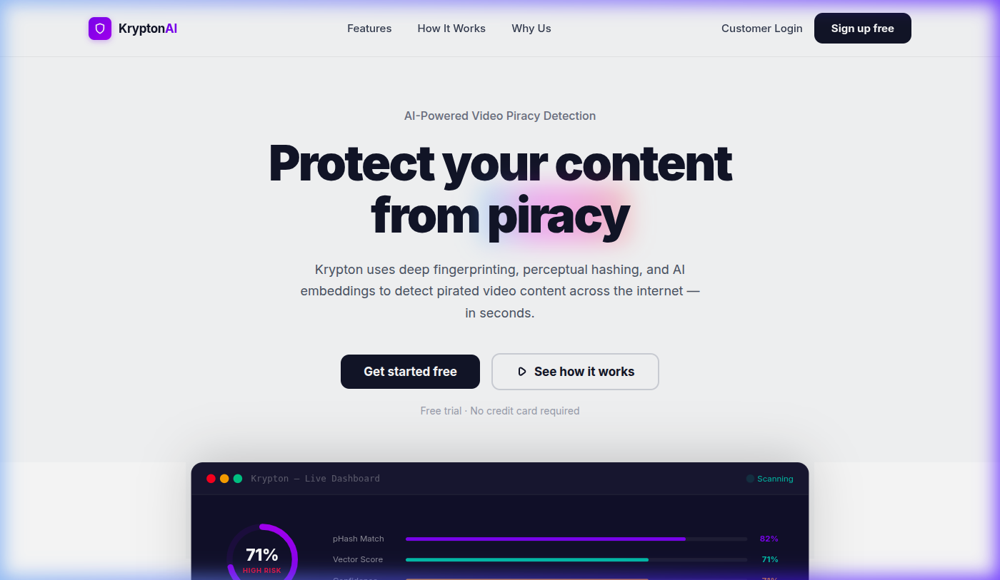
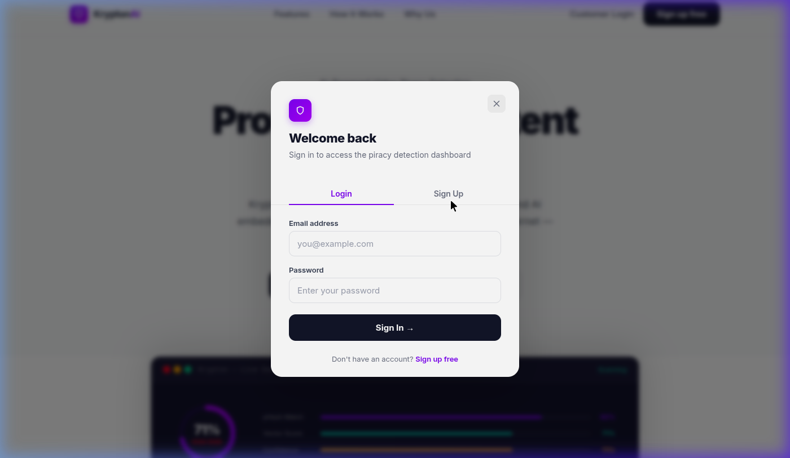
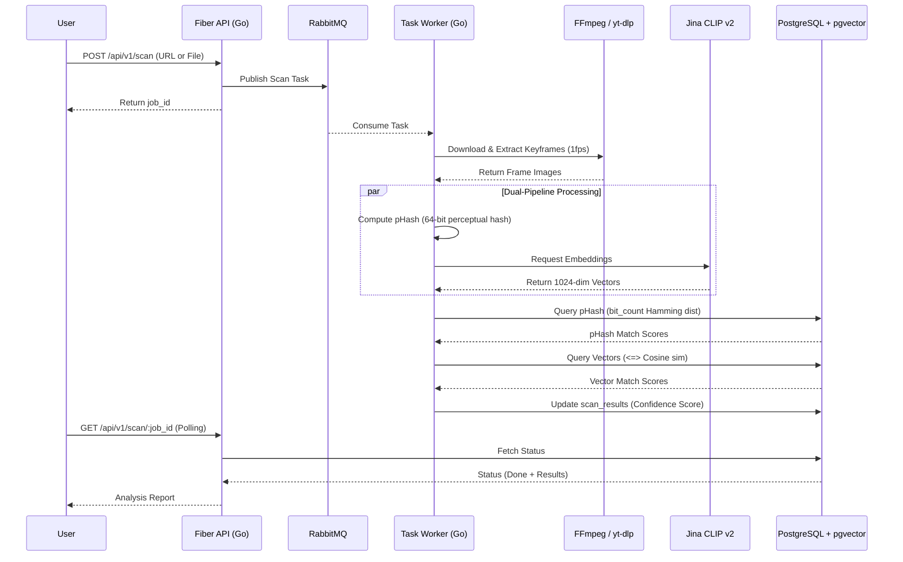
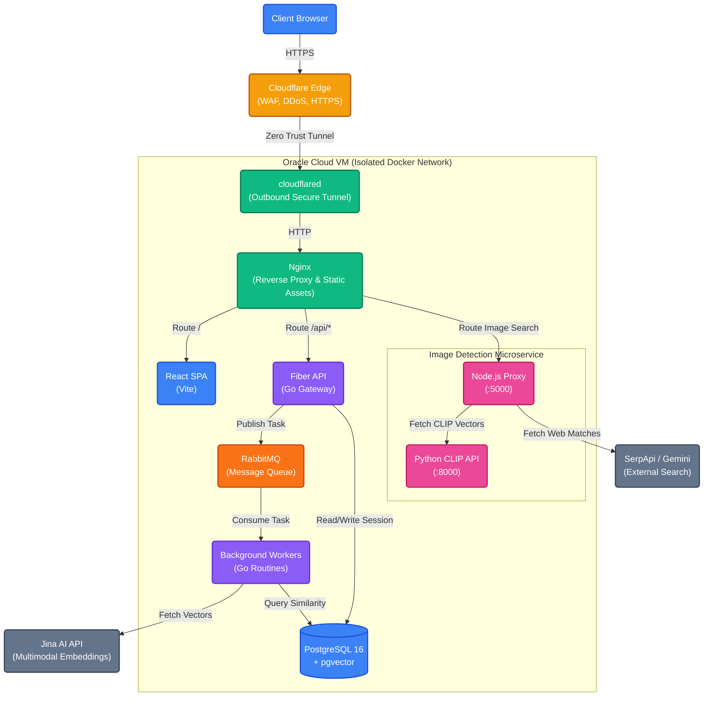
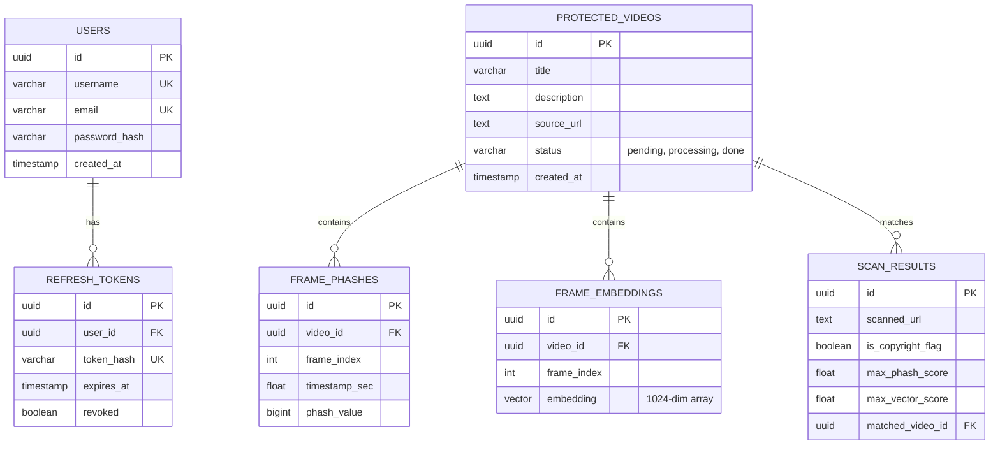

<p align="center">
  
</p>

# Krypton

## AI-powered video copyright detection that actually works.
### Perceptual hashing + deep neural embeddings to catch pirated content across the internet — in seconds.

<p align="center">
  
  
  
  
  
  
  
  
  
  
  
  
  
  
  
</p>

---

## What is this?

Krypton is a full-stack video copyright detection system. You give it a video (URL or file upload), and it tells you whether that video matches anything in your protected content database, or if it has been leaked on the public internet.

It accomplishes this through a multi-layered detection architecture:

- **Perceptual Hashing (pHash)** — Structural visual fingerprinting. Catches near-exact copies even after re-encoding, watermark overlays, or resolution changes.
- **Vector Embeddings (Jina CLIP v2)** — 1024-dimensional deep neural embeddings via pgvector. Catches semantic copies — flipped, cropped, color-graded, or speed-altered videos.
- **External Web Reconnaissance** — A dedicated multimodal microservice (Python/Node.js) that generates local embeddings via OpenAI CLIP and reverse-searches frames across the public web using external intelligence (SerpApi/Gemini) to identify unauthorized distribution.

These signals are aggregated to provide a comprehensive piracy confidence score.

---

## Screenshots

<p align="center">
  <br/>
  <em>Landing page with live dashboard preview</em>
</p>

<p align="center">
  <br/>
  <em>JWT authentication with secure httpOnly refresh cookies</em>
</p>

---

## How it works



1. Video lands on the API (URL or direct upload up to 2GB)
2. Job goes into RabbitMQ for async processing
3. Worker pulls the video, extracts keyframes with FFmpeg
4. Each frame gets hashed (pHash) and embedded (Jina CLIP v2 API)
5. Both are queried against the protected content database
6. Results are aggregated and returned with a confidence breakdown

---

## Architecture



No ports exposed to the public internet. All traffic flows through Cloudflare Tunnels.

---

## Tech stack

### 🎨 Frontend
- **React 18** — Component-based UI rendering
- **Vite** — High-performance build tool and dev server
- **Framer Motion** — Fluid, declarative UI animations
- **Recharts** — Dynamic svg-based data visualization
- **Vanilla CSS** — Custom Clarity-inspired design system with CSS variables

### ⚙️ Backend Core
- **Go (Golang) 1.22** — High-concurrency compiled backend language
- **Fiber v2** — Extremely fast, Express-inspired web framework for Go
- **Viper** — Environment configuration management
- **Zerolog** — Zero-allocation JSON logging

### 🧠 Data & AI Layer
- **PostgreSQL 16** — Primary relational database
- **pgvector** — Vector similarity search extension for PostgreSQL
- **Jina AI (CLIP v2)** — Deep multimodal embeddings API for semantic video matching
- **RabbitMQ 3** — Message broker for reliable asynchronous job dispatching

### 🎬 Video Processing Engine
- **FFmpeg** — Industry-standard video keyframe extraction (at 1 fps)
- **yt-dlp** — Open-source video downloader for extracting streams from URLs
- **Custom pHash** — Perceptual image hashing algorithm for structural similarity

### 🔐 Security
- **Cloudflare Tunnels** — Zero-Trust edge proxy, eliminating open inbound ports
- **JSON Web Tokens (JWT)** — Short-lived, stateless in-memory access tokens
- **httpOnly Cookies** — Secure, encrypted storage for long-lived refresh tokens
- **Bcrypt** — Cryptographic password hashing

### 🏗️ Infrastructure & Deployment
- **Docker & Docker Compose** — Containerization and multi-service orchestration
- **Nginx** — Internal reverse proxy routing and static asset serving
- **Terraform** — Infrastructure-as-Code (IaC) for cloud provisioning
- **Oracle Cloud (OCI)** — ARM A1 Flex production environment (Always Free Tier)

---

## Project structure

```
Krypton/
├── cmd/
│   ├── api/main.go                 # API server entrypoint
│   └── worker/main.go              # Queue worker entrypoint
├── internal/
│   ├── auth/                       # JWT tokens, middleware
│   ├── config/                     # Viper config parsing
│   ├── embedder/                   # Jina AI client
│   ├── engine/                     # Core fingerprint + comparison logic
│   ├── extractor/                  # yt-dlp + FFmpeg wrappers
│   ├── handler/                    # HTTP route handlers
│   ├── hasher/                     # pHash + dHash implementation
│   ├── models/                     # Data models
│   ├── queue/                      # RabbitMQ pub/sub
│   └── repository/                 # PostgreSQL data access
├── migrations/                     # SQL schema files
├── frontend/
│   ├── src/
│   │   ├── LandingPage.jsx         # Marketing landing page
│   │   ├── AuthModal.jsx           # Login/signup modal
│   │   ├── AuthContext.jsx         # JWT session management
│   │   ├── App.jsx                 # Scanner dashboard
│   │   └── index.css               # Design system
│   ├── nginx.conf                  # Reverse proxy config
│   └── Dockerfile                  # Multi-stage build
├── deploy/
│   ├── docker-compose.prod.yml     # Production stack
│   ├── .env.prod.example           # Environment template
│   ├── README.md                   # Deployment guide
│   └── terraform/                  # Oracle Cloud IaC
├── docker-compose.yml              # Dev stack
├── Dockerfile                      # Backend multi-stage build
└── config.yaml                     # App configuration
```

---

## Getting started

### Prerequisites

- Docker & Docker Compose
- API keys: [Jina AI](https://jina.ai/) (embeddings), [SerpAPI](https://serpapi.com/) (optional)

### 1. Clone and configure

```bash
git clone https://github.com/NKS01X/Krypton.git
cd Krypton
cp .env.example .env
# Fill in your API keys
```

### 2. Run

```bash
docker compose up --build -d
```

### 3. Scale workers

```bash
docker compose up -d --scale worker=4
```

The app is now running at `http://localhost:80`.

---

## API

All endpoints are under `/api/v1`. Auth routes are public; scanner routes require a Bearer token.

### Auth

| Method | Endpoint | Description |
|--------|----------|-------------|
| POST | `/api/v1/auth/register` | Create account |
| POST | `/api/v1/auth/login` | Get access token + refresh cookie |
| POST | `/api/v1/auth/refresh` | Rotate access token |
| POST | `/api/v1/auth/logout` | Revoke refresh token |

### Scanner (JWT required)

| Method | Endpoint | Description |
|--------|----------|-------------|
| POST | `/api/v1/scan` | Submit URL for scanning |
| POST | `/api/v1/scan/upload` | Upload video file (up to 2GB) |
| GET | `/api/v1/scan/:id` | Poll scan results |
| POST | `/api/v1/protected` | Register a video to protect |
| POST | `/api/v1/protected/upload` | Upload a protected video file |

### Image Detection Microservice
An independent Python/Node.js microservice architecture dedicated specifically to deep image analysis and external piracy web searches.

#### Architecture
The `image-detection` module splits workloads across two specialized environments:
- **Python ML Service (`ml-service/app.py`)**: A high-performance Flask API running on port `8000`. It utilizes the official OpenAI CLIP model (`ViT-B/32`) via PyTorch to generate high-dimensional image embeddings for structural similarity matching.
- **Node.js Search Proxy (`backend/server.js`)**: An Express.js coordinator running on port `5000`. It receives client requests, triggers the Python ML service for vectorization, and interfaces with external APIs (Google Gemini, SerpApi) to perform real-time cross-referencing for copyrighted image leaks on the public web.

#### Endpoints
| Method | Endpoint | Description |
|--------|----------|-------------|
| POST | `http://localhost:5000/external-search` | Takes a 512px image (`form-data` with `image` key). Identifies the entity and cross-references external web results for piracy risks. |
| POST | `http://localhost:8000/embed` | Python ML endpoint returning raw OpenAI CLIP embeddings for a 512px image. |

#### Running the Microservice
**1. Install ML Dependencies (Python):**
```bash
pip install torch torchvision torchaudio
pip install git+https://github.com/openai/CLIP.git
```

**2. Install Backend Dependencies (Node):**
```bash
cd image-detection
npm install
```

**3. Configure Environment Variables:**
```env
GEMINI_API_KEY=your_key
SERP_API_KEY=your_key
```

**4. Start Services:**
Start the Python ML model API:
```bash
python ml-service/app.py
```
Start the Node.js search proxy (CORS enabled for all regions):
```bash
node backend/server.js
```

---

## Detection methods

### Perceptual hashing

Each keyframe is reduced to a 64-bit hash representing its visual structure. Comparison uses Hamming distance via PostgreSQL's `bit_count` on XOR:

```sql
SELECT video_id, frame_index,
       (64 - bit_count(phash_value # $1)) AS match_score
FROM frame_phashes
WHERE bit_count(phash_value # $1) <= 10;
```

Resistant to: re-encoding, watermarks, contrast changes, resolution scaling.

### Vector embeddings

Frames are encoded into 1024-dim vectors using Jina CLIP v2. Similarity is evaluated via cosine distance with pgvector's IVFFlat index:

```sql
SELECT video_id, frame_index,
       (1 - (embedding <=> $1)) AS similarity
FROM frame_embeddings
ORDER BY embedding <=> $1
LIMIT 20;
```

Resistant to: horizontal flips, color grading, cropping, speed changes.

---

## Security

- **Zero-trust networking** — Cloudflare Tunnel creates an outbound-only connection. No inbound ports open on the server.
- **JWT architecture** — Access tokens (15min, in-memory only) + refresh tokens (7d, httpOnly/Secure/SameSite cookies with server-side revocation).
- **Cloudflare WAF** — Managed ruleset + OWASP Core for SQLi/XSS protection.
- **Rate limiting** — Auth endpoints rate-limited at the Cloudflare edge.
- **Network isolation** — All backend services communicate on an internal Docker network. Only Nginx is reachable from the tunnel.

---

## Deployment

Production deployment targets Oracle Cloud Always Free tier (ARM A1 Flex, 12GB RAM, $0/month forever).

Infrastructure is fully automated with Terraform. See [`deploy/README.md`](deploy/README.md) for the complete guide.

```bash
cd deploy/terraform
cp terraform.tfvars.example terraform.tfvars
# Fill in OCI credentials
terraform init && terraform apply
```

---

## Database schema



---

## License

MIT
